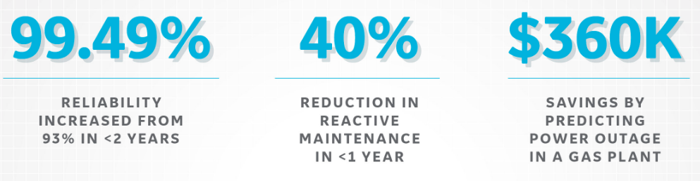

## Machine Learning for Industrial IoT Applications
#### Predict how long a part will work before performance degrades

Perect for 5G cell phone towers, mining, aerospace, large/heavy equipment, farming, autonomous vehicles and even data centers.

By combining machine-to-machine communication with industrial big data analytics, IIoT is driving unprecedented levels of efficiency, productivity, and performance. And as a result, industrial companies in original equipment manufacturing, chemicals, food and beverage, automotive, steel, and many other industries are experiencing transformative operational and financial benefits.

For industrial organizations understanding how to to digitize industrial assets, systems, and processes to better understand, predict, and optimize industrial performance to achieve improved business outcomes. 

#### Financial impact to industry



* GE reports that customers can increase reliability from 93% to 99.49% in less than two years, reduce reactive maintenance by 40% in less than one year—contributing to significant maintenance cost savings, and save $360K by predicting a power outage in a gas plant.

* According to Gartner, ““By 2021, half of large industrial companies will use digital twins, resulting in those organizations gaining a 10% improvement in effectives.”

* An IoT sensor can represent a functional asset (including fixed or rotating equipment), a component (a pump, motor, etc.), a system of assets (a turbine, jet engine, MRI machine, etc.), or a fleet of assets (a wind farm, a combined cycle unit, an aircraft, etc.). The level of representation is determined by the targeted business outcomes, e.g., reducing unplanned downtime of a compressor compared to optimizing power generation output, to preiciting remaining useful life can save millions to billions annually.


<div style="margin:30px">
   <p>Data Provided by the really, really smart folks at NASA for this example:</p>
   
</div>

Most data that comes from IoT sensors is not time series based, and can oly be time-series by the way you store data. 
This solution doesnt require that and built-in functionality handles time varying data well. 

This is a rapid way to predict the Remaining Useful Life (RUL) of an engine using an initial dataframe of time-series data from NASA [Turbofan Engine Degradation Simulation Data Set](https://ti.arc.nasa.gov/tech/dash/groups/

*To load the data, you need to download the data yourself. Download and unzip the file from[https://ti.arc.nasa.gov/c/13/](https://ti.arc.nasa.gov/c/6/) and place the files in the 'data' directory*

## Highlights
* Automated feature engineering forIoT devices
* Auto formats sensor data into time-series data
* Advanced Prediction of Remaining Useful Life (RUL), custom primitives, and hyper-parameter tuning

## Running the tutorial
1. Clone the repo


2. Install the requirements

    ```
    pip install -r requirements.txt
    ```
    

3. Download the data

    The data is from the NASA Turbofan Engine Degradation Simulation Data Set
    and is available [here](https://ti.arc.nasa.gov/tech/dash/groups/pcoe/prognostic-data-repository/#turbofan)

    To run the notebooks, place the following files in the 'data' directory:
    `train_FD004.txt`, `test_FD004.txt`, `RUL_FD004.txt`

4. Run the Tutorials notebooks:<br>

    ```
    jupyter notebook
    ```

    *The `utils.py` script contains a number of useful helper functions.*


If ML/AI for your Industrial IoT Applications is important to you or your business, please [get in touch](https://www.linkedin.com/in/computer-vision-engineer/).

### Contact

Email: joehoeller@gmail.com
